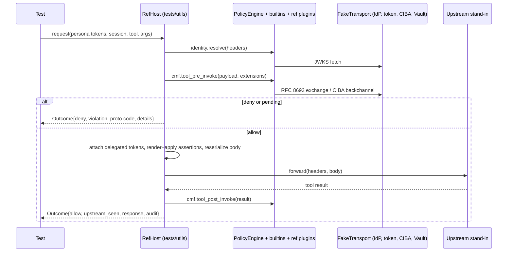

# feat: Add integration, resilience, and security test suites

## Summary

Add three praxis-style workspace test crates (`tests/integration`, `tests/resilience`,
`tests/security`) on a shared `tests/utils` crate. The centerpiece of `tests/utils` is a
reference-host driver that replays the per-request call sequence of the praxis `policy` filter
against a real `PolicyEngine` with builtins and the reference plugins. External services are
scripted through PPE's `FakeTransport`, extended with one test-only request-aware responder.
The demo scenarios land first, then the hardening and security matrices, then an env-gated
live mode with a non-blocking CI job.

---

## Problem Frame

The twelve `praxis-demos` policy-engine scenarios are the only check on the flows that combine
identity, delegation, APL, PDPs, redaction, PII, taint, CIBA, and assertions, and they run by
hand against docker-compose. No suite checks dependency failures or hostile inputs through the
full engine. See origin for the full frame.

---

## Requirements

Carried from origin (R1 to R14). Restated briefly; origin is authoritative.

- R1. Top-level praxis-style suites, one binary each, plus a shared unpublished test-utils
  crate.
- R2. Crate-owned tests stay. Only cross-crate flows are promoted; duplicated helpers move to
  test-utils where the dependency graph allows.
- R3. A make target per suite, included in CI.
- R4. All twelve demo scenarios automated with the same observable outcomes.
- R5. Each scenario runs against Cedar, CEL, and OPA.
- R6. Scenarios drive PPE at the host boundary from copied fixtures, with no proxy.
- R7. Hermetic by default.
- R8. Env-gated live mode; unset means skip.
- R9. Per-dependency failure matrix: unavailable, slow, erroring, malformed.
- R10. Fail closed: bounded-time deny with an attributable reason.
- R11. Concurrency: no cross-session or cross-principal leakage; bounded latency.
- R12. Adversarial inputs: tokens, payload size and depth, match-dodging encodings,
  delegation abuse.
- R13. Adversarial cases deny and do not leak secrets or payload values in diagnostics.
- R14. Found defects are filed under #99 and marked as known gaps without reddening CI.

**Origin acceptance examples:** AE1 (R4, R5), AE2 (R8), AE3 (R9, R10), AE4 (R11), AE5 (R12,
R13).

---

## Scope Boundaries

- No praxis or praxis-ai binary in the loop. Host wiring stays tested in `../praxis`.
- No wholesale move of per-crate tests.
- No JSON-RPC wire-format assertions (the `-32001` envelope and the `X-Policy-Violation`
  header are praxis code). Scenarios assert the engine-level equivalents.
- No tests of host-owned defenses: JSON-RPC body parsing and invalid bodies, duplicate JSON key
  rejection, body size ceilings, and duplicate-header joining live in the praxis filter. They
  belong in `../praxis/tests/integration/tests/suite/adversarial`, and `host.rs` lists them as
  not reproduced.
- No cargo-fuzz, throughput benchmarks, or perf gates.
- No changes to `praxis-demos`.
- No schema or conformance suites.
- No fixes for defects the suites find. Those land under #99 sub-issues.
- No library behavior changes. The only library edit is a test-util-gated responder in
  `crates/ppe-core/src/http_testing.rs` (see Key Technical Decisions).

### Deferred to Follow-Up Work

- Merge the roughly 20 flat binaries in `crates/ppe-apl-runtime/tests/` into a `main.rs`
  harness: separate refactor PR.
- Move duplicated JWT minting in `crates/builtins/tests/*` into `tests/utils`: blocked by the
  dev-dependency cycle (see Key Technical Decisions).
- Live Valkey failure while running, plus the pool-error and acquire-timeout branches in
  `crates/builtins/src/session/valkey/store.rs`: needs a controllable proxy in front of Valkey.
- Contributing host-sequencing scenarios to `../praxis` policy example tests with a path
  override of `praxis-policy`, as a complement to the reference host: separate praxis PR if
  host drift proves costly.

---

## Context & Research

### Relevant Code and Patterns

- Host sequence to mirror: `../praxis/crates/filter/src/builtins/http/security/policy/filter.rs`
  (`PolicyFilter::new`, `on_request`/identity gate, `on_request_body`, `on_response_body`),
  `assertions.rs`, `error.rs`, `json_rpc.rs` in the same directory. Local `../praxis` HEAD at
  planning time: `446637b0`.
- Engine lifecycle: `crates/ppe-core/src/engine.rs` (`PolicyEngine`, `load_config_yaml`,
  `initialize`, `invoke_named`, `set_http_transport`), `crates/ppe-core/src/executor.rs`
  (`PipelineResult`; plugin invokes run inside `tokio::spawn` via `invoke_contained`).
- Facade registration: `crates/ppe/src/lib.rs` (`register_builtin_plugins`,
  `builtin_pdp_factories`, `builtin_session_store_factories`, `register_apl`,
  `register_vault_secret_provider`). `install_builtins` is the one-call path; it cannot take
  extra session-store factories or Vault.
- Assertions: `crates/ppe-core/src/assertions/{config,render,apply}.rs`; secret-sourced headers
  ride on `HttpExtension.secret_headers` (`docs/content/assertions.md`).
- Scripted HTTP: `crates/ppe-core/src/http_testing.rs` (`FakeTransport`). It matches by URL
  fragment, replies from a per-fragment queue, and ignores `HttpRequest.timeout` and
  `max_response_bytes`. `with_latency` is a real sleep applied to every call.
- Fault injection: `crates/ppe-core/src/fault_testing.rs`.
- Log capture: `crates/ppe-core/src/trace_capture.rs` (process-wide, always-interested
  subscriber, thread-local sink; `#[cfg(test)]` only).
- Reference plugins: `reference/plugins/pii-scanner` (`validator/pii-scan`) and
  `reference/plugins/audit-logger` (`audit/logger`, with a `tracing` destination at target
  `apl.audit`).
- Session store and isolation key: `crates/ppe-apl-runtime/src/session_store.rs`,
  `crates/ppe-apl-runtime/src/session_resolver.rs`.
- Harness layout to follow: `crates/builtins/tests/jwt/main.rs` with `[[test]]` and
  `required-features` in `crates/builtins/Cargo.toml`; praxis `tests/integration/tests/suite/main.rs`
  and `tests/utils/src/lib.rs` (file-level clippy allow lists with `reason`).
- Live-test gating: `crates/ppe/tests/vault_live.rs`, `crates/builtins/tests/ciba/live_keycloak.rs`,
  `crates/builtins/tests/valkey/valkey_store_integration.rs` (`VALKEY_TESTS_OPTIONAL`).
- Existing coverage not to duplicate:
  - Plugin fault matrices: `crates/ppe-core/tests/safety_invariants.rs`,
    `crates/ppe-apl-core/tests/safety_invariants.rs` (including the PDP evaluate timeout).
  - Plugin-level dependency error mapping: `crates/builtins/tests/jwt/jwks_url_e2e.rs`
    (fetch timeout, unreachable at init, stale key on failing refresh,
    `concurrent_unknown_kids_produce_one_fetch`), `crates/builtins/tests/oauth`,
    `crates/builtins/tests/ciba`.
  - Token claim validation: `crates/builtins/tests/jwt/jwt_e2e.rs`.
- Promotion candidates checked during planning: `crates/ppe-apl-runtime/tests/{canonical_authn_authz_e2e,elicit_then_delegate_e2e,end_to_end_route}.rs`
  and `crates/ppe-core/tests/delegation_e2e.rs`. All four build pipelines from hand-written
  factories, and neither crate has builtins as a dev-dependency.
- Demo sources to port: `praxis-demos/demos/policy-engine/{policy,policy-cel,policy-opa}.yaml`,
  `scenarios/*.sh`, `scenarios/_lib.sh`, `hr-mcp-server/server.py`, `keycloak/realm-export.json`.

### Institutional Learnings

- Each new test binary costs about 87s on first run here (endpoint security), so keep to one
  binary per suite and no lib-test binary in test-utils.
- `make test` stays on `cargo test` with two passes. nextest is for iteration only.
- Shared tracing state made a test flaky before. Any log or audit capture must use one
  process-wide subscriber.
- Coverage is gated at 96% and runs `--include-ignored`, so live tests must skip cleanly.
- `serde_json::Map` keeps insertion order in workspace builds. Compare parsed values, not
  bytes.
- Keycloak 26.6 token exchange ignores `actor_token`. Live tests must not expect an `act`
  claim; the actor path stays covered by the mock IdP only.
- Assert exact violation codes, not just "denied".

---

## Key Technical Decisions

- **The reference host is a call sequence, not one call.** `tests/utils` provides a host driver
  that, per request, mirrors the praxis filter: identity resolve, extensions (meta, http,
  session id, carrying `HttpExtension.secret_headers` through unchanged), CMF pre-invoke,
  delegated-token attachment, request assertions, body re-serialization, an upstream
  stand-in, then CMF post-invoke and response assertions. Its module docs list the praxis
  files mirrored, the commit checked, and the host-owned behavior it does not reproduce (SSRF
  transport, Content-Length fitting, JSON-RPC parsing, duplicate-key rejection, body ceilings,
  header joining).
- **Drift is checked, not just documented.** The live workflow (U9) includes a non-blocking
  job that checks out `praxis` main, hashes the mirrored files, and fails with the diff when
  they differ from the commit recorded in `host.rs`. Updating that commit is the explicit
  review step.
- **The driver registers pieces, not `install_builtins`.** It calls `register_builtin_plugins`,
  builds `AplOptions` from `builtin_pdp_factories` and `builtin_session_store_factories` plus
  any test factories (a failing session store), calls `register_apl`, registers the reference
  plugin factories, and registers Vault through `register_vault_secret_provider` with the same
  transport.
- **Engine-level outcomes, not wire format.** The driver returns a structured outcome:
  allow/deny, violation code, protocol error code and details (for CIBA pending and approved),
  the request the upstream saw (headers, tool args, decoded bearer claims), the response
  payload and headers after post-invoke, and captured audit records.
- **In-process upstream stand-in.** A small recorder replaces `hr-mcp-server`: canned tool
  results matching `server.py`, a request log, and JWT headers decoded to claims like the demo
  recorder does.
- **One library edit: a request-aware responder in `FakeTransport`.** `FakeTransport` matches
  on URL only and never reads the body, so it cannot mint an RFC 8693 token whose `aud` and
  `sub` follow the request form. A closure responder (a fragment plus a function from the
  request to a reply), gated by `test-util` like the rest of `http_testing.rs`, lets test-utils
  mint tokens from `audience` and `subject_token` and script misbehaving endpoints. Hermetic
  fixtures give token exchange and CIBA distinct token-endpoint hosts so their reply queues
  never mix.
- **Hermetic sessions use the memory store.** Fixtures select the session store by mode; the
  Valkey store is exercised in live mode.
- **Feature gating covers test-utils too.** Cargo unifies features across the workspace before
  `required-features` filters targets, and dev-dependencies cannot be optional. So:
  - test-utils declares `praxis-policy`, `praxis-policy-core`, and the reference plugins
    without features, adds a `suite` feature turning on `praxis-policy/builtins`,
    `http-hyper`, and `praxis-policy-core/test-util`, and gates its modules behind
    `#![cfg(feature = "suite")]`.
  - Each suite crate's `suite` feature forwards `praxis-policy-test-utils/suite`, with
    `required-features = ["suite"]` on its single `[[test]]` target.
  - The default pass then builds test-utils as an empty crate and skips the suites; the
    all-features pass runs them. U1 proves this with a `cargo tree -e features` diff of the
    default pass against `main`.
- **Test-utils is a dev-dependency of the suites only.** Per-crate tests cannot use it: it
  depends on the facade, which depends on those crates, so a dev-dependency would form a cycle.
- **No promotion this round.** Applying the promotion rule ("moves only if it composes real
  builtins from two or more crates") to the four candidates leaves all of them in place,
  because each uses hand-written factories. R2's promotion clause is met with nothing to move.
  The rule stays for future tests.
- **Timeouts are scripted as errors, not simulated with latency.** Hermetic timeout, connect,
  and oversize rows use `FakeTransport::fail` with `Timeout`, `Connect`, or `ResponseTooLarge`
  and assert the violation code and its mapping (for example "possibly delivered" for a
  delegation or CIBA timeout). Elapsed-time bounds are asserted only where something enforces
  them: engine and plugin timeouts set low in the fixture (`engine_settings.plugin_timeout`,
  plugin `timeout_seconds`) with a stalling responder, and live rows against a real socket.
  `with_latency` is used only for concurrency overlap in U7.
- **OPA "unavailable" does not apply, and the PDP timeout row is dropped.** OPA runs in-process
  (regorus). OPA hardening covers malformed policy and evaluation errors. `PDP_EVALUATE_TIMEOUT`
  is a fixed 30s crate-private constant, and its deny path is already covered by
  `safety_invariants.rs`.
- **The resilience suite asserts the full-engine delta only.** Plugin-level error mapping is
  already tested in the builtin suites, so each resilience row asserts what only the full
  engine shows: the deny code in the host outcome, zero upstream calls, no inbound or minted
  token forwarded, and the elapsed bound where one applies. Each row cites the builtin test
  that pins the plugin behavior. It also covers the documented fail-open path
  (`on_error: ignore`), which must still record the error.
- **Known gaps run and expect failure.** A test exposing an open defect is named `known_gap_*`,
  asserts the desired behavior with a message containing `known gap #<issue>`, and is marked
  `#[should_panic(expected = "known gap #<issue>")]`. It runs in both passes and under coverage,
  and it turns red when the fix lands, which forces the marker's removal. No coverage skip
  filter is needed.
- **Capture works across spawned plugin tasks.** Plugin invokes run in `tokio::spawn`, so a
  thread-local sink sees their events only on a current-thread runtime. Capture-using tests run
  on current-thread runtimes. Multi-thread tests in U7 key the sink by a per-test span field
  instead. A self-test proves an audit record from a spawned plugin is captured.
- **Leak checks run everywhere.** A shared assertion checks that no planted secret appears in
  violations, pipeline errors, captured logs, audit records, or the response returned to the
  caller. It runs on every scenario (U4) as well as every adversarial case (U8). Planted
  secrets: inbound user and client tokens, the client secret, minted downstream tokens,
  Vault-sourced assertion values, CIBA `auth_req_id` and approver tokens, and the SSN value.
- **Naming mirrors praxis.** Crates `praxis-policy-tests-{integration,resilience,security}` and
  `praxis-policy-test-utils`, all `publish = false`. Each suite has its own make target
  (`test-integration`, `test-security`, `test-resilience`). As in praxis, `test-integration`
  also runs the other two, so it is the one target for the whole set.

---

## Open Questions

### Resolved During Planning

- Mock crate: `FakeTransport` plus one request-aware responder. mockito only if a wire-level
  case appears.
- Live OPA server: not needed. OPA is in-process.
- Fit with two passes and coverage: suites run in the all-features pass and count toward
  coverage. Live variants skip without env vars. Known gaps run as expected failures.
- Which live services get CI first: Keycloak and Valkey (both run in containers). Vault live
  stays local-only, like `vault_live.rs` today.
- Promotion: none of the four candidates qualifies (see Key Technical Decisions).
- Default-pass guard: `required-features` is not enough on its own; the test-utils `suite`
  feature and the `cargo tree` diff are needed.

### Deferred to Implementation

- Fixture adjustments needed to load the demo policies against the current APL and config
  shape (the demo pins ppe 0.4.x). This is only known once they are loaded.
- Whether scenario 11 can be driven fully at the host boundary. The elicitation id travels in a
  request header the filter passes through untouched, so it should work, but this is unverified
  until written.
- Exact concurrency levels and timeout slack that stay deterministic on CI runners.
- Whether `cargo llvm-cov` counts `tests/utils` toward the floor. If it does, live-only
  branches in `live.rs` may need to be small enough not to pull coverage down.
- Whether the delegator token cache answers repeated exchanges without hitting the transport,
  which changes expected call counts. Fixtures may need distinct users or a short cache TTL.
- Whether the driver models the praxis header-phase identity gate as its own step or folds it
  into the body phase. Prefer a separate step if the praxis filter makes deny decisions there.
- How the assertions contract is built in the driver: praxis parses it from the YAML through
  `parse_config`, so the driver may need the same call rather than an engine accessor.

---

## Output Structure

    crates/ppe-core/src/http_testing.rs     + request-aware responder (test-util only)
    tests/
      utils/
        Cargo.toml          suite feature; deps declared without features
        src/
          lib.rs            #![cfg(feature = "suite")], clippy allow list, pub mods
          host.rs           reference-host driver and outcome type
          idp.rs            RSA keys, JWKS, JWT minting, token-exchange and CIBA responders
          upstream.rs       MCP upstream stand-in and request recorder
          mcp.rs            tool-call payload and extension builders
          capture.rs        process-wide log and audit capture
          secrets.rs        planted-secret registry and leak assertion
          fixtures.rs       fixture loading, PDP variant and mode selection
          live.rs           env-var gating and live transport setup
      integration/
        Cargo.toml
        fixtures/           policy-{cedar,cel,opa}.yaml, keycloak realm
        tests/suite/
          main.rs
          host_contract.rs
          scenarios/        one module per demo scenario
      resilience/
        Cargo.toml
        fixtures/
        tests/suite/
          main.rs
          dependency_failure/  jwks, token_exchange, ciba, vault, session_store, pdp, ssrf
          concurrency.rs
      security/
        Cargo.toml
        tests/suite/
          main.rs
          tokens.rs  payloads.rs  match_evasion.rs  delegation_abuse.rs  elicitation_abuse.rs  redaction.rs

This tree is a scope declaration. The per-unit file lists are authoritative.

---

## High-Level Technical Design

> *This illustrates the intended approach and is directional guidance for review, not
> implementation specification. The implementing agent should treat it as context, not code to
> reproduce.*

Directional usage shape for a scenario test:

    for pdp in [Cedar, Cel, Opa]:
        host = RefHost::hermetic(fixture(pdp))
        out  = host.call(as=eve, tool="get_compensation", args={include_ssn: true, ssn: "..."})
        assert out.allowed
        assert out.upstream_seen.args.ssn == "[REDACTED]"
        assert out.response.ssn == "[REDACTED]"
        assert_no_planted_secrets(out)

---

## Implementation Units

### Phase 1: Foundation

- U1. **Workspace scaffolding and conventions**

**Goal:** The four crates exist, build, lint clean, run only in the all-features pass, and have
make targets. The known-gap convention is documented in the harness.

**Requirements:** R1, R3, R14

**Dependencies:** None

**Files:**
- Create: `tests/utils/Cargo.toml`, `tests/utils/src/lib.rs`
- Create: `tests/{integration,resilience,security}/Cargo.toml`, `tests/{integration,resilience,security}/tests/suite/main.rs`
- Modify: `Cargo.toml` (members, workspace dependency entry for test-utils; not `default-members` unless needed)
- Modify: `Makefile` (`test-integration` running all three suites, `test-security`, `test-resilience`, a help entry for each)
- Modify: `deny.toml` only if new dev-deps need it (for example, keep the `rsa` advisory rationale accurate if test-utils takes it as a normal dependency)
- Test: `tests/integration/tests/suite/main.rs` (one smoke module)

**Approach:**
- Mirror praxis crate manifests: workspace version, edition, license, `publish = false`,
  `[lints] workspace = true`.
- test-utils: dependencies declared without features, a `suite` feature enabling them, and
  `#![cfg(feature = "suite")]` on the lib so the default pass builds an empty crate. No
  `#[cfg(test)]` modules, so no lib-test binary.
- Each suite has a `suite` feature forwarding `praxis-policy-test-utils/suite`; its `[[test]]`
  sets `required-features = ["suite"]`.
- `main.rs` carries SPDX headers, `#![forbid(unsafe_code)]`, a `//!` line, and a file-level
  `#![allow(..., reason = "test code")]` mirroring praxis's list, trimmed to what is actually
  needed. Its module docs state the known-gap convention.
- Check that `cargo publish --dry-run` and `tools/publish.sh` skip the new crates.

**Patterns to follow:** `crates/builtins/Cargo.toml` `[[test]]` entries;
`../praxis/tests/integration/Cargo.toml`; `../praxis/tests/utils/src/lib.rs`.

**Test scenarios:**
- Happy path: the smoke test builds an engine through the facade and initializes an empty
  config.
- Edge case: the `cargo tree -e features` output for the default `--workspace` pass is
  identical to `main` (no builtins, redis, or test-util features unified in).

**Verification:** `make check`, `make lint`, and `make doc` are green. Under `--all-features`
the smoke test runs, and `make coverage` still passes the 96% floor.

---

- U2. **Shared test-utils: IdP, upstream, builders, capture, secrets**

**Goal:** Reusable, hermetic building blocks the three suites share, including the one
`FakeTransport` extension.

**Requirements:** R2, R7, R13

**Dependencies:** U1

**Files:**
- Modify: `crates/ppe-core/src/http_testing.rs` (request-aware responder, `test-util` gated, with doc and unit test there)
- Create: `tests/utils/src/idp.rs`, `tests/utils/src/upstream.rs`, `tests/utils/src/mcp.rs`, `tests/utils/src/capture.rs`, `tests/utils/src/secrets.rs`
- Test: `tests/integration/tests/suite/host_contract.rs` (helper self-tests live here, not in test-utils)

**Approach:**
- `FakeTransport` responder: a fragment plus a closure from the request to a reply, taking
  priority over queued replies for that fragment. Unit tested in `http_testing.rs`.
- `idp`: a fixed-seed RSA keypair, a JWKS document, and a minting helper for persona tokens
  (bob, eve, alice, the hr-copilot client) carrying the claims the demo realm issues (roles,
  teams, perms, manager, `preferred_username`). Responders for:
  - the token endpoint, minting a token from the form's `audience` and `subject_token`, with
    switches for misbehavior (broader scope, different `sub`, unexpected `issued_token_type`,
    wrong audience);
  - CIBA on its own host: backchannel ack, then polls scripted as `authorization_pending`,
    approved (with a configurable approver identity), `access_denied`, or expired.
- `upstream`: a recorder that holds the requests it saw and returns `server.py`-equivalent
  results per tool, with bearer headers decoded to claims. The returned record shape can be
  overridden for response-side redaction cases.
- `mcp`: builders for tool-call payloads, `MetaExtension` and `HttpExtension`, and the session
  id.
- `capture`: the `trace_capture.rs` pattern (process-wide, always-interested subscriber), with
  audit records from target `apl.audit` parsed as JSON. Sink keyed per test so it works on
  current-thread runtimes and, via a span field, on multi-thread runtimes.
- `secrets`: a registry of planted secrets per test and one assertion that none appear in an
  outcome, its errors, its audit records, or captured logs.
- Every pub item must be used by a suite (`dead_code` and `unreachable_pub` are denied).

**Patterns to follow:** `crates/builtins/tests/jwt/common/mod.rs`,
`crates/ppe-core/src/trace_capture.rs`, `crates/ppe-benches/src/lib.rs` builders.

**Test scenarios:**
- Happy path (`http_testing.rs` unit test): a responder sees the request body and its reply is
  returned; an unmatched fragment still fails with `Connect`.
- Happy path (`host_contract`): a minted token verifies against the generated JWKS; the token
  responder's token carries the requested `aud` and the caller's `sub`.
- Happy path (`host_contract`): the CIBA responder returns pending, then approved.
- Edge case (`host_contract`): an audit record emitted from a spawned plugin task is captured;
  two tests capturing in parallel each see only their own records.
- Edge case (`host_contract`): the leak assertion fails when a planted secret is placed in an
  audit record (proves the check is not vacuous).

**Verification:** The `http_testing.rs` unit test passes; the helper self-tests pass once U3
lands. No `dead_code` warnings.

---

- U3. **Reference-host driver and fixtures**

**Goal:** Drive a real engine the way praxis does and return a structured outcome; load the
ported demo policies per PDP.

**Requirements:** R5, R6, R7

**Dependencies:** U2

**Files:**
- Create: `tests/utils/src/host.rs`, `tests/utils/src/fixtures.rs`
- Create: `tests/integration/fixtures/policy-cedar.yaml`, `policy-cel.yaml`, `policy-opa.yaml` (ported from the demo)
- Test: `tests/integration/tests/suite/host_contract.rs`

**Approach:**
- Engine construction per Key Technical Decisions (pieces, not `install_builtins`), with
  `FakeTransport` via `set_http_transport` and `granting`.
- The driver executes the request and response sequences in the design section. Extensions
  carry `HttpExtension.secret_headers` from assertion rendering through every later hook; the
  driver never rebuilds a plain header map.
- Request and response assertions use `ppe-core` assertions config, render, and apply, the same
  API praxis calls.
- Fixtures keep the demo's policy content but point issuer, JWKS, token, and CIBA URLs at
  distinct fake hosts. Hermetic mode uses the memory session store and the audit-logger
  `tracing` destination. Mode selection (hermetic or live) rewrites only endpoints and the
  session store.
- `host.rs` module docs: mirrored praxis files, recorded praxis commit, and the host-owned
  behavior not reproduced.

**Execution note:** Start by loading each fixture into a bare engine. Fixture drift against the
current config shape is the first unknown to resolve.

**Patterns to follow:** `../praxis/crates/filter/src/builtins/http/security/policy/filter.rs`;
`crates/ppe/tests/docs_examples/llm_request.rs`.

**Test scenarios:**
- Happy path: each of the three fixtures loads and initializes without error.
- Happy path: a request with no tokens is denied at identity, with no CMF invocation and no
  upstream call.
- Integration: an allowed call reaches the upstream with delegated tokens attached and the
  inbound user-token header stripped by assertions.
- Integration: a secret-sourced assertion header appears as `<redacted secret.<name>>` in
  plugin and audit views and in clear only in the upstream request.
- Error path: an unknown tool routes to the default behavior the fixture defines, asserted
  explicitly.

**Verification:** `host_contract` passes for all three PDPs, and the driver's outcome carries
every field the scenarios need.

---

### Phase 2: Scenario suite

- U4. **Port demo scenarios 01 to 12 across three PDPs**

**Goal:** Every demo scenario is an automated test, parameterized over Cedar, CEL, and OPA.

**Requirements:** R4, R5, R6, R13; AE1

**Dependencies:** U3

**Files:**
- Create: `tests/integration/tests/suite/scenarios/mod.rs`, one module per scenario (for example `bob_allow.rs`, `alice_deny.rs`, `eve_redact.rs`, `repo_access.rs`, `pii.rs`, `taint.rs`, `adjust_compensation.rs`, `ciba_approval.rs`, `assertions.rs`)
- Modify: `tests/integration/tests/suite/main.rs`

**Approach:**
- A small per-PDP loop helper runs each scenario body against all three fixtures and labels
  failures with the PDP name.
- Expected violation codes are those in the demo scripts. Scenario 05 uses the per-PDP deny
  violation (`cedar.default_deny`, `cel.policy_denied`, `opa.policy_denied`).
- Taint scenarios share one host across calls so session state persists between steps.
- Scenario 11 drives pending (with protocol code and details), then peek, then approved, then
  apply, by advancing the CIBA responder. It also covers denied and expired branches.
- Every scenario ends with the leak assertion over its outcome and audit records.

**Test scenarios:**
- Covers AE1. 03/01: Eve's `get_compensation` returns with `ssn` redacted in both the upstream
  args and the response; Bob's identical call keeps `ssn` and the upstream bearer has
  `aud=workday-api`; neither upstream request carries `x-user-token`; no minted token appears
  in the response returned to the caller.
- 02: Alice on `get_compensation` is denied with `routes.tool:get_compensation.pre_invocation[0]`
  and zero upstream calls.
- 04/05/06: Alice internal repo is allowed with `aud=github-api`; Alice external repo is denied
  with the per-PDP violation; Bob on `search_repos` is denied at the route requirement.
- 07: Bob's email containing an SSN is denied with `pii.detected`, an audit record exists for
  `send_email`, and there are zero upstream calls.
- 08: in session T, a clean email, then `get_compensation`, then an email is denied with
  `session_tainted_secret`.
- 09: Eve taints session id S, and Bob's email in the same id S is allowed (subject-scoped
  key).
- 10: `adjust_compensation` 5000 applies directly with no elicitation.
- 11: 25000 returns pending with an elicitation id and approver `alice` and no upstream call.
  A peek before approval stays pending, after approval reports approved. The final call applies
  with one upstream call and an audit record.
- 11 error paths: CIBA `access_denied` denies with the elicitation-denied violation. Expiry
  denies and does not apply.
- 12: the upstream sees `x-auth-user-id` equal to Bob's `sub`, `x-auth-username=bob`,
  `x-auth-roles=hr`. A spoofed inbound `x-auth-user-id: root` is replaced with Bob's real
  `sub`.

**Verification:** All scenarios pass for all three PDPs; a deliberate fixture change (for
example dropping the redact) makes the matching test fail.

---

U5 was removed during review: no promotion candidate qualifies (see Key Technical Decisions).

---

### Phase 3: Hardening

- U6. **Resilience: dependency failure matrix**

**Goal:** Every external dependency's failure modes are shown to fail closed through the full
engine, without repeating plugin-level tests.

**Requirements:** R9, R10, R14; AE3

**Dependencies:** U3

**Files:**
- Create: `tests/resilience/tests/suite/dependency_failure/{mod,jwks,token_exchange,ciba,vault,session_store,pdp,ssrf}.rs`
- Create: `tests/resilience/fixtures/` (minimal policies per dependency, with low plugin timeouts)

**Approach:**
- One table-driven matrix per dependency over {connect failure, timeout, 5xx, 4xx where
  meaningful, malformed body, oversized body where a cap exists}. Each row is scripted with
  `FakeTransport::fail` or a responder, not with latency.
- Each row asserts the full-engine delta: deny with the exact violation code in the host
  outcome, zero upstream calls, and no inbound or minted token forwarded. Each row's doc
  comment cites the builtin test pinning the plugin-level mapping.
- Bounded time is asserted on rows where the fixture sets a low engine or plugin timeout and a
  responder stalls past it: the request is denied within that timeout plus slack.
- Session store failure uses a test `SessionStoreFactory` registered through `AplOptions`.
- Vault: a secret-resolution failure at init and at refresh, asserting the engine either
  refuses to start or keeps denying. Which applies is checked against the docs; a mismatch is
  a known gap.
- PDP: OPA and Cedar with a malformed policy (rejected at load) and an evaluation error.
- SSRF: one row with the hyper transport and private destinations disallowed, where a token or
  CIBA endpoint resolves to loopback and the request denies with the SSRF code. `host.rs` notes
  this is the only full-engine SSRF check.
- Fail-open check: with `on_error: ignore` on a non-gating plugin, the request proceeds and
  the error appears in the pipeline result errors.

**Execution note:** Write each matrix row first. A row that fails because of a real defect
becomes a `known_gap_` expected failure with a #99 sub-issue, per R14.

**Test scenarios:**
- Covers AE3. JWKS fetch fails with `Timeout` during request-time refresh: a token with an
  unknown `kid` is denied with an identity violation and no upstream call.
- Covers AE3. Identity plugin stalls past a low `plugin_timeout`: denied within the timeout plus
  slack, with the timeout violation.
- JWKS malformed JSON or empty key set at init: initialize or request behavior matches the
  documented soft-fail, and no request is allowed.
- Token exchange `Timeout`, 500, malformed response: deny with a delegation violation, no
  upstream call, no inbound token forwarded.
- Token exchange returns a token for the wrong audience, broader scope than requested, a
  different `sub`, or an unexpected `issued_token_type`: deny with a delegation violation and
  no upstream call.
- CIBA backchannel unavailable: deny (not pending). Token-poll `Timeout`: the documented
  `elicitation.op_timeout` mapping, not an allow.
- Session store errors on load or append: tainting routes deny; no request proceeds as if
  untainted.
- Vault unreachable at initialize: initialize fails with an attributable error.
- OPA rego syntax error: config load fails. CEL runtime error with `on_error: deny`: deny with
  the CEL violation.
- SSRF: token endpoint on loopback with private destinations disallowed denies with the SSRF
  code.
- `on_error: ignore`: allowed, and `PipelineResult.errors` contains the plugin error.

**Verification:** Every dependency has a row for each applicable failure mode. All rows either
pass or are `known_gap_` expected failures with a linked sub-issue.

---

- U7. **Resilience: concurrency isolation**

**Goal:** Under concurrent load, identity, taint, delegated credentials, and approvals never
leak across sessions or principals, and latency stays bounded.

**Requirements:** R11; AE4

**Dependencies:** U3

**Files:**
- Create: `tests/resilience/tests/suite/concurrency.rs`

**Approach:**
- One shared engine (as a host would hold) on a multi-thread runtime, with N tasks across
  several personas and sessions, interleaving taint-setting and taint-checking calls in a
  seeded random order (seed printed, overridable by env, like `PPE_STRESS_SEED`).
- Each task checks its own outcome against an oracle derived from its own sequence. Capture
  uses the span-keyed sink.
- Latency: the p99 of per-call time with a fixed `with_latency` stays under a generous multiple
  of the single-call baseline. This is a coarse regression guard, not a benchmark.
- JWKS single-flight is not repeated here; it is covered by
  `crates/builtins/tests/jwt/jwks_url_e2e.rs` (`concurrent_unknown_kids_produce_one_fetch`).

**Patterns to follow:** `crates/ppe-core/tests/engine_concurrency.rs` (seeding, env knobs).

**Test scenarios:**
- Covers AE4. Two principals in interleaved sessions; only the one that touched compensation is
  blocked from email.
- Same session id under different subjects, concurrently: isolated outcomes.
- Concurrent delegation for different users: each upstream request carries a token whose `sub`
  matches its caller, never another's (needs the request-aware token responder).
- Concurrent CIBA elicitations: approving one does not approve another.

**Verification:** Passes across repeated runs with different seeds. A failure prints the seed.

---

- U8. **Security suite: adversarial inputs**

**Goal:** Hostile inputs the engine owns are rejected, and diagnostics never leak secrets or
payload values.

**Requirements:** R12, R13; AE5

**Dependencies:** U3

**Files:**
- Create: `tests/security/tests/suite/{tokens,payloads,match_evasion,delegation_abuse,elicitation_abuse,redaction}.rs`

**Approach:**
- Reuse the demo fixtures so attacks target realistic policies.
- Each case is engine-owned: PPE receives an already-parsed payload or header map and makes the
  decision itself. Host-owned defenses are out of scope (see Scope Boundaries).
- Every case ends with the leak assertion.
- Token claim cases already covered by `crates/builtins/tests/jwt/jwt_e2e.rs` are exercised
  here only through the full engine, to show the identity deny stops the pipeline (no CMF, no
  upstream call).

**Test scenarios:**
- Covers AE5. Tokens: `alg: none`, HS256 signed with the RSA public key, wrong `iss` or
  `aud`, expired, not-yet-valid, missing `kid`, and a truncated or non-base64 segment are each
  rejected at identity with no CMF invocation.
- Tokens: an embedded `jwk`, `jku`, or `x5u` header pointing at an attacker key is rejected,
  and the transport records no fetch to the `jku` or `x5u` URL. A cross-issuer `kid` (issuer
  A's `iss` with issuer B's `kid`) is rejected. An unknown `crit` header is rejected.
- Tokens: a burst of tokens with random unknown `kid` values causes at most one JWKS refetch
  per `min_refresh_interval_secs`.
- Tokens: the user token sent as the client token and vice versa does not escalate.
- Payloads: deeply nested args beyond `MAX_STRUCTURED_DEPTH` are rejected with the depth code;
  an oversized args string is handled without panic.
- Match evasion: a tool name in different case, with Unicode homoglyphs or zero-width
  characters, or with trailing whitespace does not reach the `get_compensation` allow path
  without its gates.
- Match evasion: `adjust_compensation` with `amount` as a string `"25000"`, as `2.5e4`, as an
  integer beyond f64 precision, as a negative value, or as an object or array: each elicits
  approval or denies, with zero upstream calls without approval.
- Delegation abuse: replaying a minted downstream token as the inbound user token is rejected;
  a token exchanged for audience A is not attached on a route delegating to B.
- Elicitation abuse: after approval for 25000, a retry with the same id and amount 90000 is
  denied by the scope check. A second apply with the approved id is denied or re-elicits, and
  the upstream call count stays at 1. The approved id on a different tool is denied. Bob's id
  redeemed under Eve's identity is denied. A CIBA approval whose approver does not match
  `login_hint` is denied with the elicitation violation.
- Redaction (response side): the upstream returns the record with a case-variant `SSN` key,
  inside an array, nested one level deeper, and stringified inside a text content part. For
  each, Eve's response contains no planted SSN value, or the case is a known gap.
- Taint: a tainted subject retries the email under a fresh session id. The outcome is recorded
  either as documented accepted behavior (with a pointer to the tainting docs) or as a
  `known_gap_` case under #99.

**Verification:** Every case denies with an exact code, or is a `known_gap_` expected failure
with a sub-issue. The leak assertion runs on every case.

---

### Phase 4: Live mode

- U9. **Live mode, CI jobs, and docs**

**Goal:** The same scenarios run against real Keycloak, Valkey, and Vault when configured, with
non-blocking CI jobs (including host drift) and contributor docs.

**Requirements:** R8, R3; AE2

**Dependencies:** U4, U6

**Files:**
- Create: `tests/utils/src/live.rs`
- Create: `tests/integration/fixtures/keycloak/realm-export.json` (copied from the demo)
- Modify: `tests/utils/src/fixtures.rs`, `tests/utils/src/host.rs` (live transport and endpoints)
- Create: `.github/workflows/integration-live.yml` (Keycloak and Valkey service containers and a host-drift job; `continue-on-error`; scheduled and manual dispatch; no bearer values echoed)
- Modify: `docs/content/testing.md`, `CONTRIBUTING.md` (suite layout, make targets, live env vars, known-gap convention, host-drift check)
- Modify: `.claude/CLAUDE.md` and `AGENTS.md` quick reference for the new make targets

**Approach:**
- Env vars follow existing names where they exist (`VALKEY_TEST_URL`, `VAULT_*`) plus a
  Keycloak base URL. Live variants are `#[ignore]` and return early when their variable is
  unset, so coverage's `--include-ignored` stays green.
- In live mode, personas mint real tokens from the realm (password and client-credentials
  grants), and assertions on the `act` claim are skipped.
- CIBA live runs only when an auto-approve channel is available; otherwise it skips with a
  message.
- The host-drift job checks out `praxis` main, hashes the files listed in `host.rs`, and fails
  with the diff when they differ from the recorded commit.

**Test scenarios:**
- Covers AE2. With no live variables set, every live test reports skipped, and the suite and
  coverage pass.
- With `VALKEY_TEST_URL` set, scenarios 08 and 09 run against the Valkey session store and
  pass.
- With the Keycloak URL set, scenarios 01 to 06 and 12 pass against the real realm.
- Host drift: changing a mirrored praxis file without updating the recorded commit makes the
  drift job fail with that file named.

**Verification:** The live workflow passes on a manual dispatch, and the docs describe how to
run each suite locally.

---

## System-Wide Impact

- **Interaction graph:** Adds workspace members and one `test-util`-gated responder in
  `crates/ppe-core/src/http_testing.rs`. No production code paths change, unless a known gap is
  later fixed under #99.
- **Feature unification:** The main risk to existing tests. The test-utils `suite` feature,
  `required-features` on the suites, and the `cargo tree` diff keep the default pass unchanged.
- **CI time:** The all-features pass gains three binaries, roughly 87s each locally on first
  run because of endpoint security (CI runners are unaffected). Live and drift jobs are
  separate and non-blocking.
- **Coverage:** Suites add coverage of builtins and runtime code. Known gaps run as expected
  failures, so they neither fail the floor nor hide behind a skip.
- **Host drift:** Checked by the drift job. Praxis currently pins ppe 0.4.1 from crates.io, so
  praxis's own policy example tests check the released engine, while this suite checks `main`.
- **Unchanged invariants:** No public API changes beyond the test-only responder.
  `safety_invariants.rs` matrices, per-crate tests, and `make test`'s two passes stay as they
  are.

---

## Risks & Dependencies

| Risk | Mitigation |
|------|------------|
| Demo fixtures do not load against the current config shape | U3 loads fixtures first; adjustments are recorded in the fixture headers |
| The reference host diverges from praxis | Drift job diffs the mirrored files; outcomes are engine-level |
| Suite or test-utils features unify into the default pass | test-utils `suite` feature, `required-features`, and the `cargo tree` diff in U1 |
| Timing assertions flake on CI | Timeouts scripted as errors; elapsed bounds only on low configured timeouts with generous slack; seeds printed |
| Audit capture misses spawned-task events, making leak checks vacuous | Current-thread or span-keyed sink, plus a self-test that plants a secret and expects the check to fail |
| Expected-failure known gaps pass for the wrong reason | Each asserts the desired behavior with a gap-specific message, and `should_panic(expected = ...)` matches it |
| Many defects found at once overwhelm the release | Known-gap convention lets the suite land; #99 sub-issues prioritize fixes |
| Live Keycloak realm drifts from the demo | Realm copied into fixtures; live job non-blocking |

---

## Sources & References

- **Origin document:** [docs/brainstorms/2026-10-07-integration-test-suite-requirements.md](../brainstorms/2026-10-07-integration-test-suite-requirements.md)
- Epic: https://github.com/praxis-proxy/policy/issues/99
- Praxis suites: `../praxis/tests/{integration,security,resilience,utils}`
- Demo: `praxis-demos/demos/policy-engine`
- Testing docs: `docs/content/testing.md`, `docs/safety-invariants.md`, `docs/content/assertions.md`
